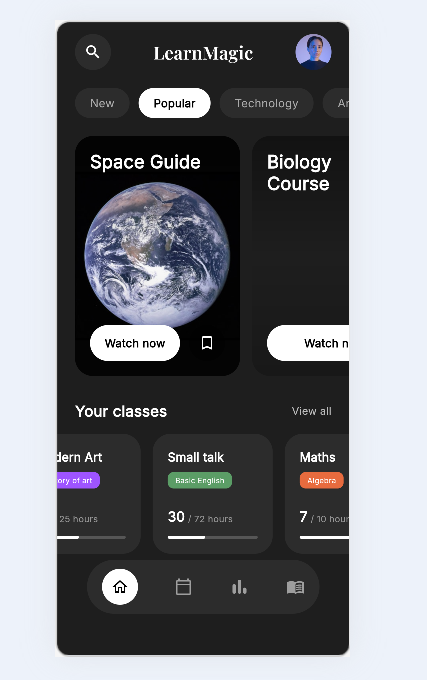

# LearnMagic (Flutter UI Reproduction)

## Description du projet
Ce projet est une reproduction fidèle d'une interface utilisateur (UI) d'application mobile issue d'une maquette Dribbble. L'application, nommée "LearnMagic", propose un design sombre (Dark Theme) élégant et moderne pour une plateforme d'apprentissage en ligne.
Ce projet a été réalisé avec Flutter dans le cadre d'un exercice d'intégration d'interface utilisateur, en veillant à respecter au maximum :
- Les couleurs (Dark theme, contrastes)
- Les polices (Utilisation de Google Fonts : Playfair Display pour le logo, Inter pour le reste)
- Les espacements et dimensions
- Le responsive design

## Maquette Dribbble
https://dribbble.com/shots/27389573-Online-Education-Mobile-App

## Structure du projet
Le code source est organisé de manière modulaire dans le dossier `lib/` :
- `main.dart` : Point d'entrée de l'application et configuration du thème.
- `screens/home_screen.dart` : Écran principal assemblant tous les widgets.
- `widgets/` : Composants réutilisables (App bar, Tabs, Cartes de cours, Bottom Navigation, etc.).

## Difficultés rencontrées
- **Assets manquants** : N'ayant pas accès aux assets originaux (images des cartes, photo de profil), nous avons utilisé des images similaires de haute qualité provenant d'Unsplash.
- **Polices d'écriture** : La maquette originale semble utiliser un mélange de Serif et Sans-Serif. L'intégration de la librairie `google_fonts` a permis de reproduire ce rendu fidèlement avec "Playfair Display" et "Inter".
- **Responsive** : Assurer que les éléments (comme la Bottom Navigation Bar flottante) s'adaptent bien sur des écrans de tailles différentes tout en conservant les proportions de la maquette originale.

## Captures d'écran
Voici l'image de la maquette originale


Voici l'image de ma realisation



## Exécution
Pour lancer ce projet :
```bash
flutter run
```
